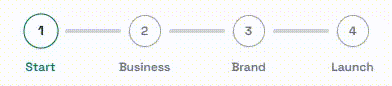

# animated-stepper

A small controlled React stepper with animated connector transitions, typed props, and theme tokens.

- Live demo: https://stepper.mayerattila.site/
- npm: https://www.npmjs.com/package/animated-stepper
- React: 18 or 19
- TypeScript types: included

The demo site is a playground for the package. It is intentionally simple: preview the component, change steps and theme values, then copy the props shape into your app.

## Preview



## Install

```bash
npm install animated-stepper
```

Import the component and stylesheet:

```tsx
import Stepper from "animated-stepper";
import "animated-stepper/style.css";
```

## Quick Start

```tsx
import { useState } from "react";
import Stepper, { type Step } from "animated-stepper";
import "animated-stepper/style.css";

const steps: Step[] = [
  { key: "account", label: "Account" },
  { key: "details", label: "Details" },
  { key: "confirm", label: "Confirm" },
];

export function CheckoutStepper() {
  const [activeStep, setActiveStep] = useState(0);
  const [pendingStep, setPendingStep] = useState<number | null>(null);

  const requestStep = (nextStep: number) => {
    if (pendingStep !== null) return;
    if (nextStep < 0 || nextStep >= steps.length) return;
    if (nextStep === activeStep) return;

    setPendingStep(nextStep);
  };

  return (
    <>
      <Stepper
        steps={steps}
        activeStep={activeStep}
        pendingStep={pendingStep}
        onCommitStep={(step) => {
          setActiveStep(step);
          setPendingStep(null);
        }}
      />

      <button onClick={() => requestStep(activeStep - 1)}>Previous</button>
      <button onClick={() => requestStep(activeStep + 1)}>Next</button>
    </>
  );
}
```

## How It Works

`animated-stepper` is controlled by your app.

- `activeStep`: committed/current step index.
- `pendingStep`: target step while the connector animation runs.
- `onCommitStep`: called when the active connector finishes animating.

Keep `pendingStep` as `null` when idle. Set it to the target index to start a transition. In `onCommitStep`, commit the new `activeStep` and clear `pendingStep`.

## API

### `Stepper`

```tsx
<Stepper
  steps={steps}
  activeStep={activeStep}
  pendingStep={pendingStep}
  theme={theme}
  onCommitStep={(step) => {
    setActiveStep(step);
    setPendingStep(null);
  }}
/>
```

| Prop | Type | Required | Description |
| --- | --- | --- | --- |
| `steps` | `Step[]` | Yes | Steps in display order. |
| `activeStep` | `number` | Yes | Current committed step index. |
| `pendingStep` | `number \| null` | Yes | Target step during animation, or `null` when idle. |
| `theme` | `Partial<StepperTheme>` | No | Visual token overrides. |
| `onCommitStep` | `(step: number) => void` | Yes | Fires after the moving connector transition ends. |

### `Step`

| Field | Type | Required | Description |
| --- | --- | --- | --- |
| `key` | `string` | Yes | Stable unique step key. |
| `label` | `string` | Yes | Label rendered below the dot. |
| `description` | `string` | No | Optional app metadata. Not rendered by the component. |

### Exports

```tsx
import Stepper, {
  Stepper as NamedStepper,
  defaultStepperTheme,
  type Step,
  type StepperProps,
  type StepperTheme,
} from "animated-stepper";
```

## Theme

Pass any subset of `StepperTheme` through the `theme` prop.

```tsx
<Stepper
  steps={steps}
  activeStep={activeStep}
  pendingStep={pendingStep}
  theme={{
    brand: "#0f766e",
    connectorWidthPx: 56,
    connectorDurationMs: 360,
  }}
  onCommitStep={(step) => {
    setActiveStep(step);
    setPendingStep(null);
  }}
/>
```

Default tokens:

| Token | Default |
| --- | --- |
| `connectorWidthPx` | `48` |
| `connectorGapPx` | `8` |
| `connectorDurationMs` | `320` |
| `dotDurationMs` | `220` |
| `brand` | `#2563eb` |
| `track` | `#d1d5db` |
| `dotBg` | `#ffffff` |
| `inactiveBorder` | `#9ca3af` |
| `inactiveText` | `#6b7280` |
| `activeText` | `#1f2937` |
| `completeText` | `#ffffff` |
| `labelInactive` | `#6b7280` |

## Styling

Import once in your app entry:

```tsx
import "animated-stepper/style.css";
```

The package stylesheet defines the layout and animation classes. Theme values are applied as CSS variables from the `theme` prop.

## Notes

- Step indexes are zero-based.
- The component does not manage form state or routing.
- Jumping forward or backward is supported by setting `pendingStep` to any valid step index.
- Duplicate or empty step keys should be normalized by your app before rendering.
